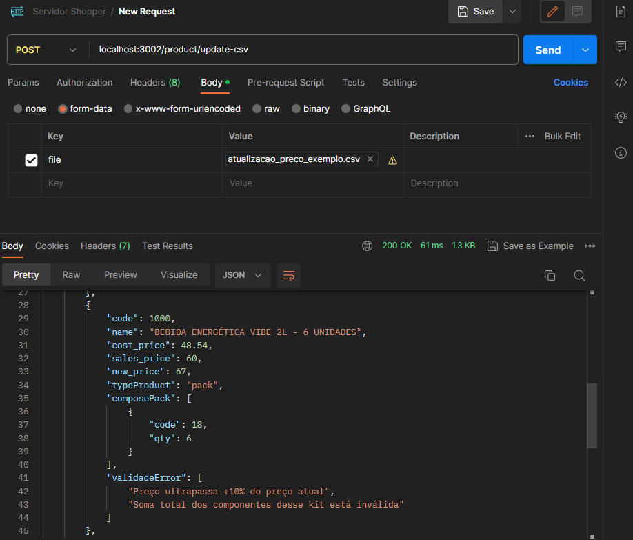

# 🚀 Desafio FullStak Shopper.com.br (Repositório BACKEND - VERSÃO 2)

Bem-vindo(a). Este é o desafio BACKEND, para a Shopper.com.br!
O objetivo deste desafio é um teste técnico para avaliar habilidades em desenvolvimento de software.

### Screenshots



# 🧠 Contexto
... Ver Repositório  FrontEnd ... 

## 📋 REQUISITOS

- [x] O sistema deve permitir que o usuário carregue o arquivo de precificação
- [x] O sistema deve ter um botão chamado VALIDAR
    - [x] Todos os campos necessários existem?
    - [x] Os códigos de produtos informados existem?
    - [x] Os preços estão preenchidos e são valores numéricos validos? 
    - [x] Os códigos de produtos informados existem?
    - [x] Valida: Preço não pode estar abaixo do custo
    - [x] Valida: Reajuste maior ou menor do que 10%
    - [x] Nova Regra: Valida Tipo de produto, é unitário, é um kit, ou faz parte de um kit
    - [x] Valida: Se é um Kit - o csv deve conter os reajustes dos preços dos componentes do pacote.
        - [x] Valida: verificar se preço final da soma dos componentes seja igual ao preço do pacote.
- [x] Finalizar Validação: e exibir Código, Nome, Preço Atual, Novo Preço
- [x] Exibir ao lado de cada produto qual regra foi quebrada
- [x] Habilitar botão ATUALIZAR, somente se todas as linhas estiverem validadas
    - [x] Ao clica em ATUALIZAR, o sistema deve salvar o novo preço no banco de dados, com tela pronta para o envio de um novo arquivo. 
    - [x] Nova Regra: Valida Tipo de produto, é unitário, é um kit, ou faz parte de um kit
    - [x] O preço de custo dos pacotes também deve ser atualizado como a soma dos custos dos seus componentes. 


## 👨‍💻 Instalação

### BACKEND

1. Clonar este repositório
```bash
git clone https://github.com/kleutons/shopper-backend-v2
```

2. Instalar dependência 
```bash
npm install
```
3. Configurar aquivo .env e colocar na raiz da pasta do servidor, exemplo:
```
SERVER_PORT = 3002

DB_USER = "root"
DB_PASSWORD = "pass"
DB_DATABASE = "shopper"
DB_HOST = "localhost"
DB_PORT = 3306
```

4. Executar Front-end
```bash
npm run dev
```

5. Acessar Servidor BACKEND na porta: 3002  -> porta configurável no arquivo .env
```
http://localhost:3002/
```

6. ROTAS Disponíveis
- http://localhost:3002/product => Rota GET para listar todos produtos
- http://localhost:3002/product?unique => Rota GET para listar produtos únicos, que não fazem parte de uma kit
- http://localhost:3002/product?unique=false  => Rota GET para listar produtos que é corresponde um kit de produtos
- http://localhost:3002/product/update-csv  => Rota POST para receber upload de arquivo CSV e retornar se está válido
- http://localhost:3002/product/update-csv  => Rota PUT que também recebe upload de arquivo CSV e se for válido atualiza em massa o dados no banco de dados SQL

7. Arquivo DATABASE para enviar no servidor mysql, está na pasta /database

[database.sql](./database/database.sql)

8. Arquivo para testes CSV para testar upload no servidor, está na pasta /database

[atualizacao_preco_exemplo.csv](./database/atualizacao_preco_exemplo.csv)


### Para acessar site Fronteend
Siga os passos descrito no Readme do repositório referente ao servidor frontend: 
- https://github.com/kleutons/shopper-frontend

## 👨‍💻 Sobre Mim
### Made with 💙 by [@kleutons](https://github.com/kleutons)

### Contato
- [LinkedIn](https://www.linkedin.com/in/kleuton-novais/)
- [Portfólio](https://kleuton.dev)

###
Aguardo seu feedback e sugestões sobre esta solução.